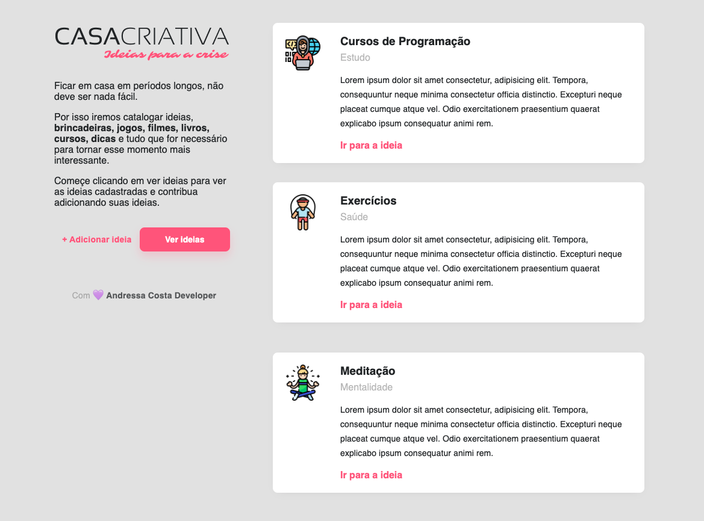
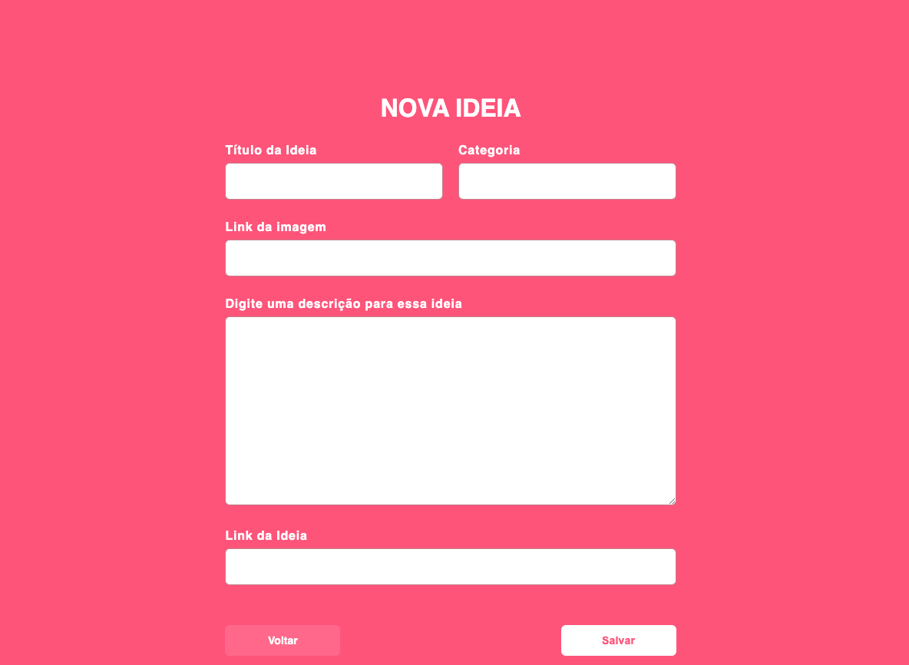
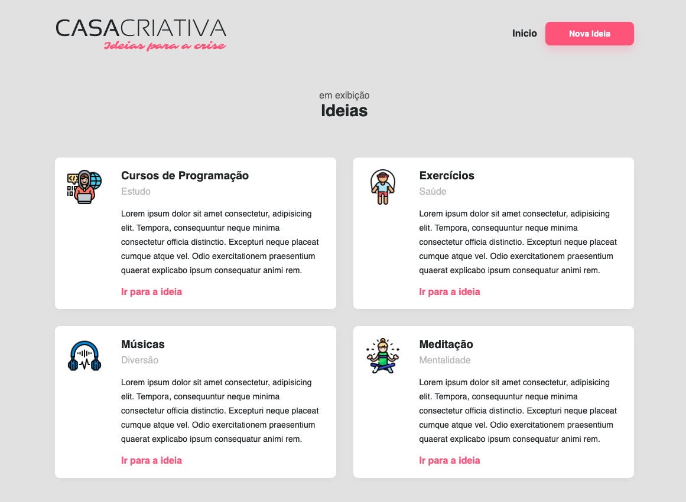

# :pushpin: Sumário

1. [Objetivo do Projeto](#dart-objetivo-do-projeto)
2. [Sobre](#page_with_curl-sobre)
3. [Tecnologias Utilizadas](#rocket-tecnologias-utilizadas)
4. [Requisitos](#gear-requisitos)
5. [Rodar o Projeto](#arrow_forward-rodar-o-projeto)
6. [Resultado](#keyboard-resultado)
7. [Redes Sociais](#woman_technologist-redes-sociais)

---

## :dart: Objetivo do Projeto

Sistema para criar uma coleção de ideias para tornar o momento de confinamento pelo Covid-19 mais interessante e organizado.

## :page_with_curl: Sobre

Esse foi um projeto desenvolvido em paralelo com a semana omni stack 11, na [WorkshopDev Especial](https://www.youtube.com/playlist?list=PL85ITvJ7FLohGTWaE_p0J6B-TLmQbN4ka), o diferencial desse projeto foi trabalhar com o Sqlite3, que é um banco sql bem simples e pequeno, e a biblioteca nunjucks também foi novidade, ela é um template engine assim como o ejs, mas acho que o nunjucks é um projeto da mozilla, acho que o design desse projeto ficou muito bonito também.

## :rocket: Tecnologias Utilizadas

*  <strong>[HTML5](https://developer.mozilla.org/pt-BR/docs/Web/HTML)</strong>
*   <strong>[CSS3](https://developer.mozilla.org/pt-BR/docs/Web/CSS) </strong>
*  <strong>[JS](https://developer.mozilla.org/pt-BR/docs/Web/JavaScript)</strong>
*  <strong> [Node.js](https://nodejs.org/en/)</strong>

**Dependências**
*  <strong> [sqLite 3](https://www.sqlite.org/download.html) </strong>
* [express](https://expressjs.com/)
* [nunjucks](https://mozilla.github.io/nunjucks/)

## :gear: Requisitos

* [Git](https://git-scm.com/) (Opcional)
* [Node.js](https://nodejs.org/en/)
* [Npm](https://www.npmjs.com/) (É instalado junto com o Node)

## :arrow_forward: Rodar o Projeto

* Primeiro passo, clone o projeto em sua maquina
* Abra a pasta do projeto no terminal
* Instale as dependências com o comando `npm i` 
* Inicie o servidor com o comando `npm start` 
* Abra uma aba no navegar e navegue para http://localhost:3001/

## :keyboard: Resultado

### Telas

---

**&copy;  [Rocketseat](https://rocketseat.com.br/)**

**Instrutor: [Mayk Brito](https://github.com/maykbrito)**

## :woman_technologist: Redes Sociais

* [Instagram](https://www.instagram.com/andressacostaaaaaa/)
* [Linkedin](https://www.linkedin.com/in/andressa-da-costa)

## Licença

[MIT](LICENSE)

<h4 align="center">
  <em>&lt;/&gt;</em> by <a href="https://github.com/AndressaDaCosta" target="_blank">AndressaCosta</a>
  </h4>
